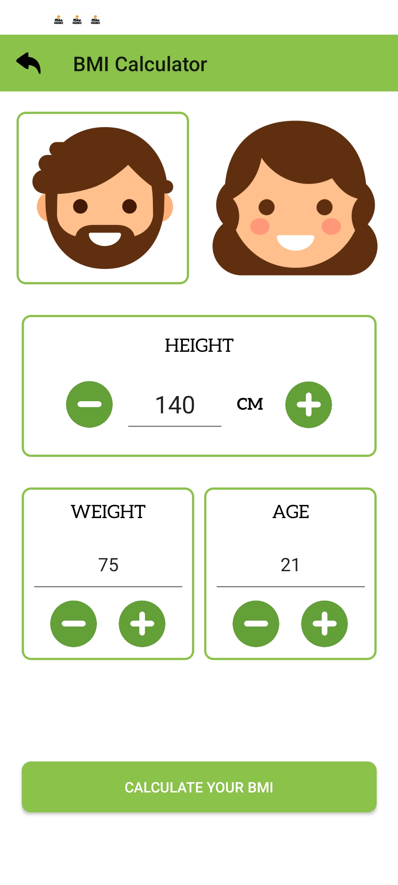
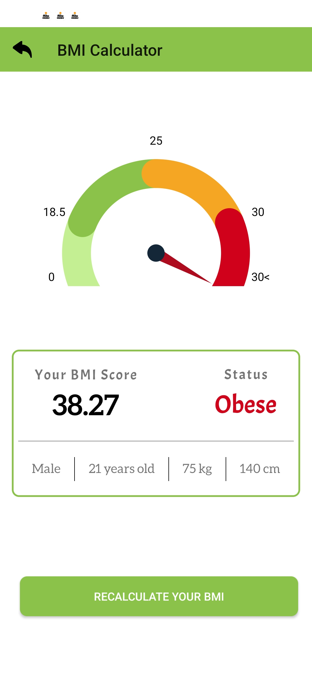

# BMI Calculator Android App

## Table of Contents
- [Introduction](#introduction)
- [Features](#features)
- [Screenshots](#screenshots)
- [Technologies Used](#technologies-used)
- [Installation](#installation)
- [Usage](#usage)
- [Contributing](#contributing)
- [License](#license)
- [Contact](#contact)

## Introduction

Welcome to the **BMI Calculator Android App**! This application provides a user-friendly interface to calculate Body Mass Index (BMI) based on user inputs such as age, height, weight, and gender. The app features a custom animated BMI gauge that visually represents the BMI category, making it easier to understand health status at a glance.

## Features

- **User Inputs:**
  - Age
  - Height (cm)
  - Weight (kg)
  - Gender (Male/Female)

- **BMI Calculation:**
  - Accurate BMI computation based on standard formula.

- **Custom BMI Gauge:**
  - Animated needle indicating BMI value.
  - Colored segments representing different BMI categories:
    - Underweight
    - Normal weight
    - Overweight
    - Obese

- **Responsive Design:**
  - Intuitive and accessible user interface.
  - Error handling for invalid inputs.

- **Result Display:**
  - Displays calculated BMI score.
  - Shows BMI category with corresponding color.
  - Option to navigate back to the input screen.

## Screenshots

<div align="center">

  <div style="border: 2px solid black; padding: 5px; display: inline-block;">
    
    <p><em>Main screen with input fields and gender selection.</em></p>
  </div>

  <div style="border: 2px solid black; padding: 5px; display: inline-block;">
    
    <p><em>Result screen displaying BMI score, category, and animated gauge.</em></p>
  </div>

</div>


## Technologies Used

- **Programming Language:** Kotlin
- **Development Environment:** Android Studio
- **Libraries:**
  - AndroidX Core
  - Material Components
  - Custom Views and Animations

## Installation

1. **Clone the Repository:**
   ```bash
   git clone https://github.com/yourusername/bmi-calculator-android.git

Open in Android Studio:

Launch Android Studio.
Click on File > Open... and navigate to the cloned repository folder.
Select the project to open it.
Build the Project:

Ensure you have the latest version of Android Studio and necessary SDKs installed.
Click on Build > Make Project or press Ctrl + F9.
Run the App:

Connect an Android device or start an emulator.
Click on Run > Run 'app' or press the Run button.
Usage
Launch the App:

Open the BMI Calculator app on your Android device.
Input Data:

Enter your age using the increment and decrement buttons or directly type the value.
Enter your height in centimeters.
Enter your weight in kilograms.
Select your gender by tapping on the Male or Female button.
Calculate BMI:

Click on the Calculate BMI button.
The app will navigate to the Result screen displaying your BMI score and category.
View Results:

Observe your BMI score and the corresponding category.
The animated gauge visually represents your BMI status.
Click on the Go Back button to return to the input screen and perform another calculation.
Contributing
Contributions are welcome! If you'd like to contribute to this project, please follow these steps:

Fork the Repository

Create a Feature Branch:

bash
Copy code
git checkout -b feature/YourFeatureName
Commit Your Changes:

bash
Copy code
git commit -m "Add some feature"
Push to the Branch:

bash
Copy code
git push origin feature/YourFeatureName
Open a Pull Request

License
This project is licensed under the MIT License.

Contact
If you have any questions or suggestions, feel free to reach out:

Email: prataprj.personal@gmail.com
GitHub: PratapRJ
LinkedIn: https://www.linkedin.com/in/prataprj/
