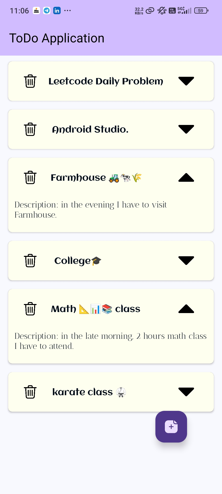
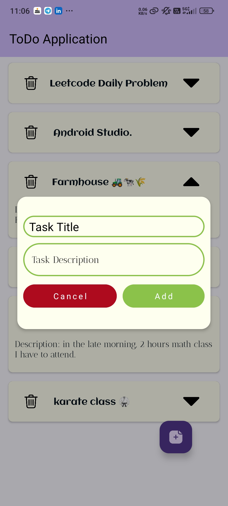

# ToDo Application

A simple, user-friendly To-Do application built using Android's MVVM architecture with Room database. This app helps users manage their tasks by adding, deleting, and updating them with a clear and organized UI.

## Features

- **Add New Tasks**: Add tasks with titles and descriptions.
- **Delete Tasks**: Remove tasks with a delete button.
- **View All Tasks**: View the list of tasks in a RecyclerView with a toggleable description view.
- **Room Database**: Persistent storage for tasks, even if the app is closed.
- **MVVM Architecture**: Organized structure with ViewModel and Repository for effective data management.

## Project Structure

- **`Task.kt`**: Defines the data model for a task, with attributes for title, description, completion status, and an auto-generated primary key.
- **`TaskDao.kt`**: The Data Access Object (DAO) with methods for inserting, deleting, and retrieving tasks from the database.
- **`TaskDatabase.kt`**: Room database instance for managing the task database.
- **`TaskRepository.kt`**: Repository layer for abstracting the data access from the rest of the app.
- **`TaskViewModel.kt`**: ViewModel for managing UI-related data and using coroutines for database operations.
- **`RecyclerAdapter.kt`**: RecyclerView adapter for displaying tasks in a card layout, with options to delete, update.
- **`MainActivity.kt`**: Main UI activity for initializing and managing the task list, including the add task dialog.

## Screenshots

<div align="center">

  <div style="border: 2px solid black; padding: 5px; display: inline-block;">
    
    <p><em>Home screen with Task RecyclerView and Task List.</em></p>
  </div>

  <div style="border: 2px solid black; padding: 5px; display: inline-block;">
    
    <p><em>Dialog which used to add new Task in Task List.</em></p>
  </div>

</div>

## Getting Started

### Prerequisites

- **Android Studio**: Install the latest version.
- **Gradle**: Make sure Gradle is up-to-date in Android Studio.

### Installation

1. Clone this repository to your local machine:
   ```bash
   git clone https://github.com/your-username/todo-application.git
   ```
2. Open the project in Android Studio.
3. Build and run the project on an emulator or Android device.

### Usage

- **Add Task**: Click on the floating action button (FAB) to open a dialog for adding a new task.
- **Mark as Complete**: Use the checkbox on each task to mark it as completed.
- **Delete Task**: Click the delete icon on a task card to remove it from the list.
- **Expand/Collapse Description**: Toggle the task description visibility with the arrow icon on each card.

## Libraries Used

- **Room**: For local database management.
- **Lifecycle**: ViewModel and LiveData for managing UI-related data.
- **RecyclerView**: Efficient list display with a custom adapter and ViewHolder.
- **Coroutines**: For asynchronous operations in the ViewModel.

## Contributing

If you'd like to contribute, please fork the repository and make changes as you'd like. Pull requests are welcome!

## License

This project is licensed under the MIT License.

---

### Acknowledgements

- Thanks to Android’s official documentation and community tutorials for guidance.
